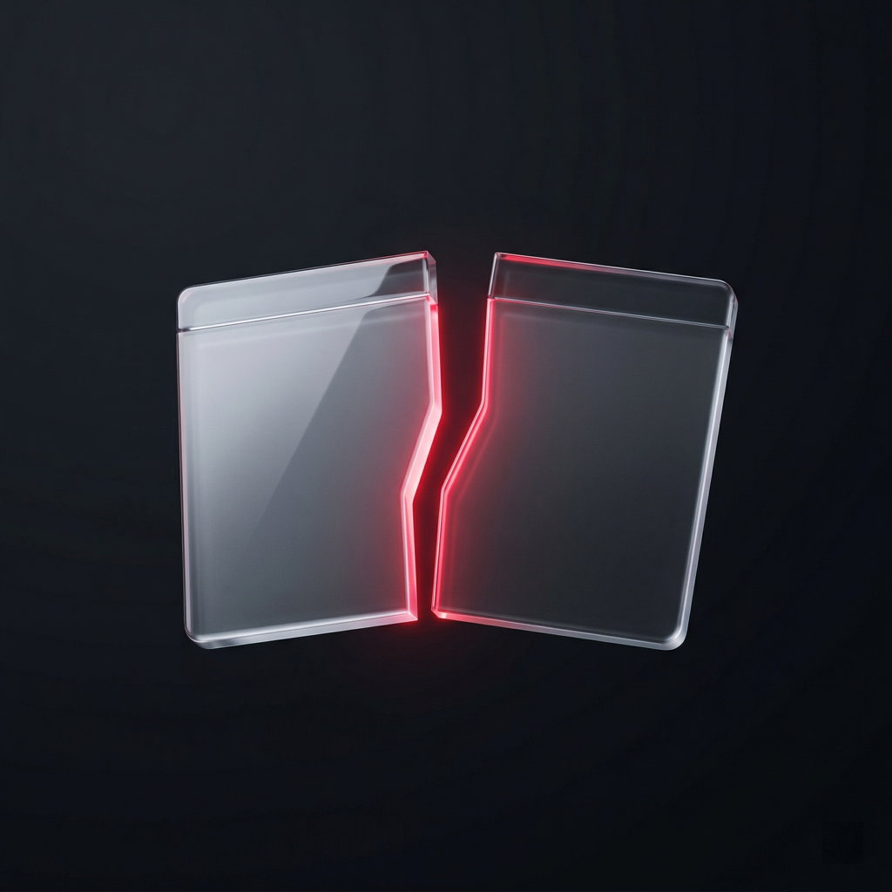

  

  
# killeverybody  
  맥에서 실행 중인 앱·프로그램을 목록으로 보여 준 뒤, 원하는 걸 골라 강제로 종료할 수 있는 도구예요.  
메뉴 막대 전용 앱이나 맥 시스템에 꼭 필요한 프로세스는 가급적 건너뜁니다.

---

## 설치하기

1. **[Releases에서 최신 DMG](https://github.com/devuterian/killeverybody/releases)** 를 받아요. (`KillEverybody-macOS.dmg`)
2. DMG를 열고, **killeverybody.app**을 **응용 프로그램** 폴더에 끌어다 놓아요.
3. 앱을 실행하면 끝이에요.

**보안 경고가 뜨면:** GitHub Actions로 자동 빌드한 앱이라 **개발자 서명·공증이 없을 수** 있어요. **우클릭 → 열기**로 한 번만 실행하거나, **시스템 설정 → 개인 정보 보호 및 보안**에서 허용해 주면 돼요.

**업데이트:** 맥 메뉴 **killeverybody → 최신 릴리즈 열기…** 로 Releases 페이지를 열 수 있어요.

---

## 이런 걸 해줘요

- 범위를 고른 뒤 **대상 수집**을 누르면, 끌 수 있는 프로세스를 표로 쭉 보여줘요.
- **강제 종료 실행**을 누르면 확인 창이 한 번 뜨고, 선택한 프로세스를 모두 종료해요.

## 이런 건 못해요

- 메뉴 막대 앱을 **항상** 정확하게 걸러내진 못해요. 앱마다 구현 방식이 달라서 그래요. **설정(톱니바퀴)** 에서 **예외 번들**이나 **메뉴 막대로 취급할 번들**을 넣을 수 있어요. 자주 쓰는 메뉴 막대 도구는 앱 안에 **프리셋 번들**도 넣어 뒀어요.
- 맥을 안전하게 유지해 준다고 **보장하지는 않아요.** 다만 시스템에서 중요한 프로세스 이름은 미리 목록에서 제외해 뒀어요.

---

## 쓰기 전에 꼭 읽어 주세요

저장 안 한 문서나 작업 중인 파일은 **그대로 날아갈 수 있어요.** 반드시 목록을 먼저 확인하고, 괜찮을 때만 진행해 주세요.

버그나 질문은 [Issues](https://github.com/devuterian/killeverybody/issues)에 남겨 주세요.

---

## 사용 방법

1. 왼쪽에서 **종료 범위**를 골라요.
   - **GUI 앱만** — 화면에 띄워진 앱 위주. 메뉴 막대·보호 번들·에이전트는 가급적 빼요.
   - **현재 사용자 프로세스 전체** — 로그인한 사용자 기준으로 더 넓게 수집해요. 위험한 이름·보호 번들은 마찬가지로 제외돼요.
   - **관리자 권한 (실험적)** — 위와 같은 범위인데, 실행 시 맥 비밀번호를 요구할 수 있어요. 꼭 필요할 때만 써 보세요.
2. **대상 수집**을 눌러요.
3. 오른쪽 표에서 이름과 경로를 쭉 확인해요.
4. **강제 종료 실행** → 확인하고 진행해요.

**설정(톱니바퀴):**

- **예외 번들 ID** — 아예 끄지 않을 앱.
- **메뉴 막대로 취급할 번들** — 메뉴 막대 앱처럼 빼고 싶을 때.
- **정책 보내기 / 가져오기** — 위 두 목록을 JSON으로 저장·불러오기 (다른 맥과 맞출 때).

---

## 소스 코드·기여

저장소: [github.com/devuterian/killeverybody](https://github.com/devuterian/killeverybody)

- 빌드: [`docs/build.md`](docs/build.md)
- 기여·훅·CI: [`CONTRIBUTING.md`](CONTRIBUTING.md)
- 수동 점검 체크리스트: [`docs/smoke-test.md`](docs/smoke-test.md)
- 동작 요약: [`SPEC.md`](SPEC.md)

---

## 라이선스

[MIT License](LICENSE) — 자유롭게 쓰되, **위험한 도구**라는 점과 손해 면책 조항은 라이선스 전문을 확인해 주세요.

---

글 표현은 [토스의 8가지 라이팅 원칙](https://toss.tech/article/8-writing-principles-of-toss)을 참고해 짧고 읽기 쉽게 맞췄어요.
