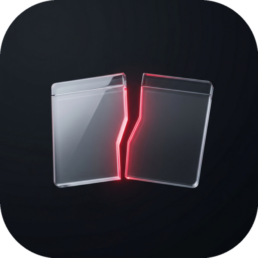

  

# killeverybody  
진짜야? 프로그램 입맛 맞추느라 그렇게 된거야?  
 
[한국어](README.md) | [English](README.en.md) | [日本語](README.ja.md)
 
 
키플러님의 Windows용 [다죽여](http://kippler.com/allkill/)에서 영감을 받아서 Cursor + Composer 2로 만들었어요.

---

## 설치하기

1. **[Releases에서 최신 DMG](https://github.com/devuterian/killeverybody/releases)** 를 받아요. (`KillEverybody-macOS.dmg`)
2. DMG를 열고, **killeverybody.app**을 **응용 프로그램** 폴더에 끌어다 놓아요.
3. (선택) 같은 DMG 안 **killeverybody-cli**는 터미널에서 후보만 보거나(`--dry-run`) 실행할 수 있어요. 자세한 옵션은 [`docs/build.md`](docs/build.md)를 봐 주세요.
4. 앱을 실행하면 끝이에요.

**보안 경고가 뜨면:** GitHub Actions로 자동 빌드한 앱이라 **개발자 서명·공증이 없을 수** 있어요. **우클릭 → 열기**로 한 번만 실행하거나, **시스템 설정 → 개인 정보 보호 및 보안**에서 허용해 주면 돼요.

**업데이트:** 메뉴 **killeverybody → 업데이트 확인…** 으로 Sparkle이 새 DMG를 알려 줘요. 수동으로는 **최신 릴리즈 열기…** 로 Releases로 가면 돼요.

---

## 쓰는 법

1. 창에 **「다 죽일까요?」** 가 보여요.
2. **다죽이기** — 실행 중인 앱과 그 자식 프로세스를 끕니다. 설정에 넣은 예외는 **적용하지 않아요**.
3. **적당히 죽이기** — 같은 범위에서 **예외 앱·메뉴 막대 앱·LSUIElement**를 빼고 끕니다.
4. **예외 앱…** — 아이콘이 있는 앱 목록에서 검색하고 체크할 수 있어요. 첫 실행 때 macOS 로그인 앱이 기본으로 체크되고, 바꾸면 바로 저장됩니다.
5. 버튼을 누르면 추가 확인 없이 바로 실행합니다. 성공하면 killeverybody도 같이 종료되고, 실패했을 때만 결과를 보여 줘요.
6. **종료** — 앱만 끕니다.

자동으로 다시 뜨는 서드파티 앱은 연결된 LaunchAgent를 **현재 로그인 세션에서만** 내립니다. 설정 파일은 바꾸지 않아서 다음 로그인 때는 원래대로 다시 켜져요.

---

## 이런 건 못해요

- 메뉴 막대 앱을 **항상** 완벽하게 구분하진 못해요. **적당히 죽이기**는 그걸 줄이려고 프리셋·설정을 씁니다.
- Finder처럼 macOS가 직접 관리하는 시스템 앱은 다시 켜질 수 있어요.
- 맥을 안전하게 유지해 준다고 **보장하지는 않아요.**

---

## 소스 코드·기여

저장소: [github.com/devuterian/killeverybody](https://github.com/devuterian/killeverybody)

- 빌드: [`docs/build.md`](docs/build.md)
- 기여·Sparkle secret: [`CONTRIBUTING.md`](CONTRIBUTING.md)
- 수동 점검: [`docs/smoke-test.md`](docs/smoke-test.md)
- 동작 요약: [`SPEC.md`](SPEC.md)

버그·질문은 [Issues](https://github.com/devuterian/killeverybody/issues)에 남겨 주세요.

---

## 라이선스

[MIT License](LICENSE) — 위험한 도구라는 점과 면책 조항은 라이선스 전문을 확인해 주세요.

한국어 README 문장은 [토스의 8가지 라이팅 원칙](https://toss.tech/article/8-writing-principles-of-toss)을 참고해 짧게 맞췄어요.

---

저장소 운영·문서 골격은 [LPFchan/repo-template](https://github.com/LPFchan/repo-template)을 참고해 꾸렸어요. 
템플릿을 공개해 주셔서 정말 고마워요.

